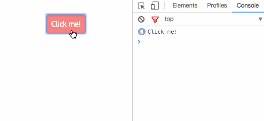

# Handling events

Let's build a simple button that does nothing besides logging to console:



```jsx
import React, {MouseEvent} from 'react'

const Clicker: React.FC = () => {
    const handleButtonClick = (event: MouseEvent<HTMLElement>) => {
        console.log(event.currentTarget.textContent)
    }

    return (
        <button onClick={handleButtonClick}>Click me!</button>
    )
}
```

In React, all event listeners are attached to an element via `onEventName` property. This is similar to veeery old school JavaScript, but uses `camelCase`.

## Pass, not call

It's important to remember that we are passing the callback as a prop, not calling it:

```jsx
<button onClick={handleButtonClick()}>Click me!</button>
```

As long as we don't intent to call this function each time a component is rerendered.

## Fake event

The event received in the callback is slightly different than expected. For starters, it's imported from React instead of just being in global namespace. In fact, it's an instance of the [Synthetic Event](https://reactjs.org/docs/events.html#overview) - this is quite important for React internals, but for us it's just there to avoid a gotcha moment.

### Resources

* [List of supported events](https://reactjs.org/docs/events.html#supported-events)
* [Handling Events](https://reactjs.org/docs/handling-events.html)

