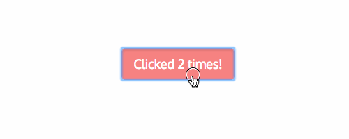

# Components with internal state

Let's do a little bit more with the button. Let's make it count clicks.



## Naive implementation

```jsx
const Clicker: React.FC = () => {
    let clicks = 0;
    const handleButtonClick = () => {
        clicks++;
    }

    return (
        <button onClick={handleButtonClick}>Clicked { clicks } times</button>
    )
}
```

[](https://codesandbox.io/s/working-clicker-lri99?fontsize=14)

Boom, done. Except it doesn't work, because React has no idea that it should rerender the `Clicker` component or keep track of the `clicks` variable.

## Using the `useState` hook

Current **Industry Best Practice ™** for keeping track of the state. Previously, we would use class components, but hooks have some advantages over them.

```jsx
import React, { useState } from "react"

const Clicker: React.FC = () => {
    const [clicks, setClicks] = useState<number>(0)
    const handleButtonClick = () => {
        setClicks(clicks + 1)
    }

    return (
        <button onClick={handleButtonClick}>Clicked { clicks } times</button>
    )
}
```

### Rules of Hooks

There are just two rules you have to remember to use Hooks properly:

1. **Only Call Hooks at the Top Level**
2. **Only Call Hooks from React Functions**

Some people say there are just two rules but reality is that they exist to address problems with magic used to implement Hooks.

They make using Hooks harder.

### [](https://codesandbox.io/s/stupefied-dawn-y5bdl?fontsize=14)

## Resources

* [Docs: State](https://reactjs.org/docs/faq-state.html)
* [Docs: `useState` hook](https://reactjs.org/docs/hooks-state.html)
* [`useState` hook examples](https://daveceddia.com/usestate-hook-examples/)
* [Rules of Hooks](https://reactjs.org/docs/hooks-rules.html)

