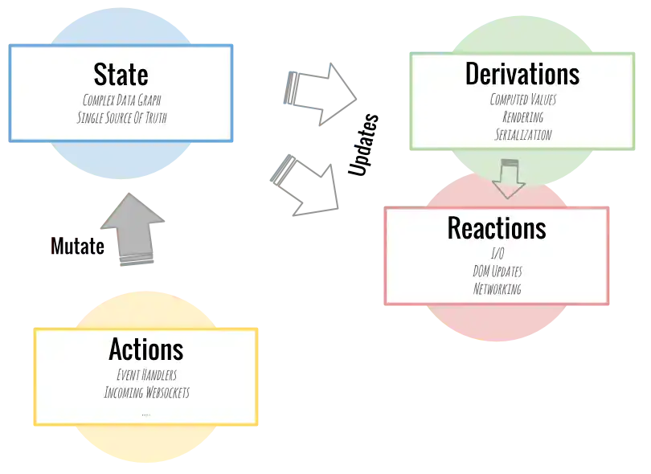

# State Management

Before React started supporting `context` officially, there were no good way of managing application state. That's basically why React, MobX and other libraries was created, and for some developers these are the only viable options. 

### Redux

### MobX

### Resources 

* ​[Mobx image](https://www.robinwieruch.de/mobx-react)​
* ​[Redux image](https://medium.com/@northerneyes/the-evolution-of-redux-action-creators-2973018bf2ae)​

